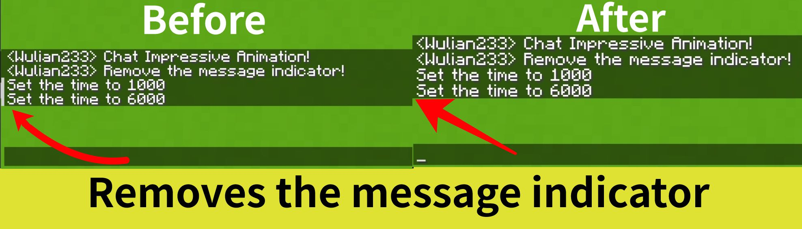
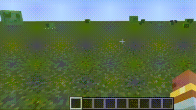

# Chat Impressive Animation

[简体中文](README_ZH.md) English

[Chat Animation](https://github.com/Ezzenix/ChatAnimation) unofficial architectury port.

This mod makes the chat look better by adding animations. Such as opening chat, sending messages. It also removes the message indicator.

## 📖 What's this mod? 

Chat Impressive Animation(CIA) is [Chat Animation](https://github.com/Ezzenix/ChatAnimation)'s unofficial architectury port, now available on Fabric and Neoforge. 

For mc versions 1.20.4 and earlier, Forge support is also provided, but message sending animations is not supported.

This mod makes the chat look better by adding animations. Such as opening chat, sending messages. It also removes the message indicator.

## ✅ Features

- Open chat animation
- Closing chat animation
- Message sending animation (Unsupported Forge)
- Removes the message indicator(mc1.19.1+)

## ✨ Screenshots

## 📖 Usage

Using this mod is very simple!

First of all, you need to install Architectury API and Cloth Config API, and then you can install this module and use it!

## 👀 License

This mod is available under the [MIT license](LICENSE).
